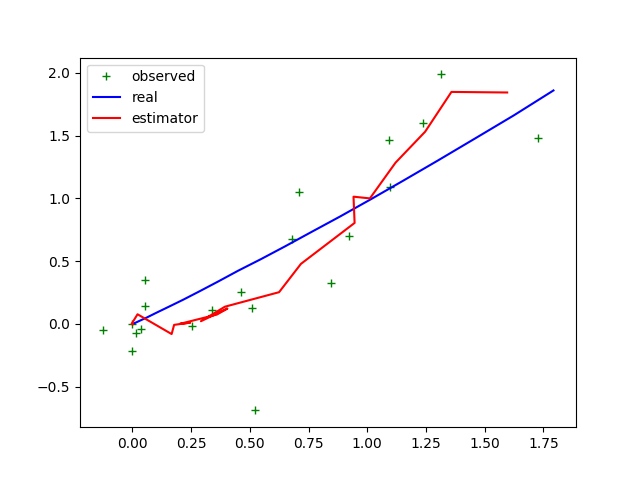

# Kalman Filter 

### 贝叶斯滤波讨论

前面我们介绍了贝叶斯滤波方法，在贝叶斯滤波方法中，两个重要过程

**状态预测**
$$
Bel(x_t) = \int P(x_t| x_{t-1}, u_t) Bel(x_{t-1}) dx_{t-1}
$$
**状态更新**
$$
Bel(x_t) = \eta P(z_t|x_t) Bel(x_t)
$$
假设$Bel(x_{t-1})$是任意分布，方程会比较难以求解，针对这种情况，可以考虑用蒙特卡罗方式求解，也即粒子滤波算法，这里不讨论粒子滤波算法。假设$Bel(x_t)$服从高斯分布，可以直接用分布的均值和方差来表示分布。这就会比较容易处理了。

### 高斯分布

1. 一元高斯分布：

$$
p(x) \sim N(\mu, \sigma^2)
$$

$$
p(x)  = \frac {1} {\sqrt {2 * \pi}\sigma} e^{-\frac{1}{2} \frac{(x-\mu)^2}{\sigma^2}}
$$

​	其中，$\mu$和$\sigma^2$分别表示期望和方差。

2. 多元高斯分布：
   $$
   p(\mathbb x) \sim N( \boldsymbol {\mu}, \Sigma)
   $$
   其中，$\boldsymbol{\mu}, \Sigma$分别表示均值，协方差矩阵。

3. 假设$\mathbb x \sim N(\boldsymbol{\mu}, \Sigma$,则对于线性变换$\mathbb y =A \mathbb x+B$有，
   $$
   \mathbb y\sim N(A \boldsymbol{\mu} + B, A\Sigma A^T)
   $$

4. 假设$ x_1 \sim N( {\mu_1}, \sigma_1^2),  x_2 \sim N( {\mu_2}, \sigma_2^2)$，$ x_1,  x_2$相互独立，对于线性组合$y =  x_1 +  x_2$有，
   $$
   y \sim N( {\mu_1} + {\mu_2}, \sigma_1^2 + \sigma_2^2 + 2\rho\sigma_1\sigma_2)
   $$

5. 假设$ x_1 \sim N( {\mu_1}, \sigma_1^2),  x_2 \sim N( {\mu_2}, \sigma_2^2)$，$x_1, x_2$相互独立，则$p(x_1) P(x_2)$：
   $$
   p( x_1) p( x_2) \sim N(\frac {\sigma_2^2} {\sigma_1^2+\sigma_2^2} \mu_1 + \frac {\sigma_1^2} {\sigma_1^2+\sigma_2^2} \mu_2, \frac {\sigma_1^2 \sigma_2^2} {\sigma_1^2+\sigma_2^2} )
   $$


### Kalman 滤波

**符号约定**

1. $\mathbb x_t$是一个n位向量，表示t时刻的状态的均值；
2. $P_t$是t时刻状态的协方差矩阵，是一个$n \times n$的矩阵；
3. $\mathbb u_t$表示t时刻模型的控制输入，是一个$m$维的输入；
4. $\mathbb z_t$表示t时刻模型的观测量，是一个$l$维的输入；
5. $A_t$表示状态由t-1时刻到t时刻的转移矩阵，是一个$n \times n$的矩阵；
6. $B_t$表示从控制量到状态量的转移矩阵，是一个$n \times m$的矩阵；
7. $H_t$表示从状态到观测的转换矩阵，是一个$l \times n$的矩阵；
8. $R_t, Q_t$分别表示观测噪声矩阵和过程噪声矩阵，大小分别是$l \times l, n \times n$

**基本假设**

1. 系统状态方程是线性的；
2. 观测方程是线性的；
3. 过程噪声符合零均值高斯分布的；
4. 观测噪声符合零均值高斯分布的；

对于某系统，假设其状态方程为：
$$
\mathbb x_t = A_t \mathbb x_{t-1} + B_t \mathbb u_t + \epsilon_t
$$
观测方程为：
$$
\mathbb z_t = H_t \mathbb x_t + \delta_t
$$
**滤波算法**

1. 预测过程

   根据假设，状态，误差都是服从高斯分布的，根据状态方程，易得

   t时刻均值为：
   $$
   \mathbb x_t = A_t \mathbb x_{t-1} + B_t \mathbb u_t
   $$
   t时刻方差为：
   $$
   P_t = A_t P_{t-1} A_t^T + Q_t
   $$
   从贝叶斯角度推算有
   $$
   P(\mathbb x_t| \mathbb x_{t-1}, u_t) \sim N(A_t \mathbb x_t + B_t \mathbb u_t, Q_t)
   $$
   所以预测方程有
   $$
    {Bel(\mathbb x_t)} = \int p(\mathbb x_t | \mathbb x_{t-1}, \mathbb u_t) Bel(\mathbb x_{t-1}) d\mathbb x_{t-1}
   $$

   此过程为两个高斯分布的卷积，具体可查阅相关推导文献，这里不赘述，可得：
   $$
   {Bel(x_t)} = \begin{cases} 
   \mathbb x_t = A_t \mathbb x_{t-1} + B_t \mathbb u_t  \\
    P_t = A_tP_{t-1}A_t^T + Q_t\end{cases}
   $$

2. 更新过程

   从贝叶斯滤波角度看有：
   $$
   P(z_t|x_t) \sim N(H_t \mathbb x_t, Q_t)
   $$

   $$
   Bel(x_t) \sim N(\mathbb x_t, P_t)
   $$

   所以有
   $$
   Bel(\mathbb x_t) = \eta P(z_t|x_t) Bel(x_t)
   $$
   此过程为两个高斯分布的求积过程，可得
   $$
   Bel(\mathbb x_t) = \begin{cases}
   \mathbb x_t = \mathbb x_t + K_t(\mathbb z_t - H_t \mathbb x_t) \\
   P_t = (I - K_t H_t)P_t
   \end{cases}
   其中， K_t = P_t H_t^T(H_tP_tH_t^T + R_t)^{-1}
   $$
   由此可有卡尔曼滤波的五条公式：

   Prediction:
   $$
   \mathbb x_t = A_t \mathbb x_{t-1} + B_t \mu_t \\
   P_t = A_t P_t A_{t-1}^T + Q_t
   $$
   Update:
   $$
   K_t = P_tH_t^T(H_tP_tH_t^T + R_t)^{-1} \\
   \mathbb x_t = \mathbb x_t + K_t (\mathbb z_t - H_t \mathbb x_t) \\
   P_t = (I-K_tH_t)P_t
   $$
   更新部分，还可以用另外的形式表示：

   首先计算观测值与预测值的残差有：
   $$
   Residual_t = \mathbb z_t - H_t \mathbb x_t
   $$
   然后计算观测值的协方差：
   $$
   S_t = H_tP_tH_t^T + R_t
   $$
   增益(权重)系数：
   $$
   K_t = P_t H_t^T S_t^{-1}
   $$
   $H_t$将状态空间转到观测空间，增益系数近似于两者的比值，所以基于增益系数有，
   $$
   \mathbb x_t = \mathbb x_t + K_t Residual_t
   $$

   $$
   P_t = P_t - P_t H_t^T S_t^{-1}H_t P_t
   $$

   这里着重解释下$K_t$，前面说了$K_t$是两者的比值，也就是如果$K_t$越小，则说明，观测的误差越大，这样估计值更靠近预测值，反之如果观测误差越小，则$K_t$越大，估计值就更靠近观测值。

### 应用举例

1. 假设有一机器人在一平面上运动，其状态可表述为$(x, y, v_x, v_y)​$，分别是机器人当前位置，$x​$和$y​$方向上的速度值。机器人运动模型为：
   $$
   \begin{cases}
   x_{t+1} = x_t + v_x * dt \\
   y_{t+1} = y_t + v_y * dt \\
   v_x = v_x + a_x * dt \\
   v_y = v_y + a_y * dt 
   \end{cases}
   $$
   其中$a_x, a_y$分别是输入的控制量。机器人的控制周期是0.1s, 也即$dt = 0.1$。机器人携带了一个感知当前位置的传感器，每0.1s能给出当前的位置。现在估计机器人每个时刻的坐标。

   式（27）写成乘法的形式：
   $$
   \mathbb x_{t+1} = \begin{pmatrix} 1.  & 0.  & 1. & 0. \\ 0. & 1. & 0. & 1. \\ 0. & 0. & 1. & 0. \\ 0. & 0. & 0. & 1. \end {pmatrix} \mathbb x_t + \begin {pmatrix}  0. & 0. \\ 0. & 0. \\ 1. & 0.  \\ 0. & 1. \end {pmatrix} \mathbb u_t
   $$
   其中$\mathbb x_t = (x, y, v_x, v_y)^T,  \mathbb u_t = (a_x, a_y)^T$。

   仿真实现该系统，具体文件可参考src/filter/kalman_filter.py文件：

   a. 首先实现机器人仿真部分

   ```python
   class Robot(object):
       def __init__(self, x=0.0, y=0.0):
           self.x = 0.0
           self.y = 0.0
           self.v_x = 0.0
           self.v_y = 0.0
           self._process_variance = np.diag([0.5, 0.5]) ** 2 # 设置实际的执行误差
           self._observe_variance = np.diag([0.5, 0.5]) ** 2 # 设置实际的观测误差
   
       def move(self, a_x = 1., a_y = 1., dt=0.1):
           a_x = a_x + np.random.randn() * self._process_variance[0, 0]
           a_y = a_y + np.random.randn() * self._process_variance[1, 1]
           self.x = self.x + self.v_x * dt
           self.y = self.y + self.v_y * dt
           self.v_x = self.v_x + a_x * dt
           self.v_y = self.v_y + a_y * dt
   
       def observe(self):
           x = self.x + np.random.randn() * self._observe_variance[0, 0]
           y = self.y + np.random.randn() * self._observe_variance[1, 1]
           return x, y
   
       def get_true_state(self):
           return self.x, self.y
   ```

   b. 滤波估计机器人位置

   ```python
   class KFEstimator(object):
       def __init__(self, x, y, vx, vy, P):
           self.X = np.matrix([x, y, vx, vy]).T
           self.P = P
   
       def predict(self, u, Q, dt=0.1):
           A = np.matrix([ [1., 0., dt, 0. ],
                           [0., 1., 0., dt ],
                           [0., 0., 1., 0. ],
                           [0., 0., 0., 1. ]])
           B = np.matrix([ [0., 0.],
                           [0., 0.],
                           [dt, 0.],
                           [0., dt]])
           self.X = A * self.X + B * u
           self.P = A * self.P * A.T + Q
           return self.X
   
       def update(self, z, R):
           H = np.matrix([ [1., 0., 0., 0.],
                           [0., 1., 0., 0.]])
           residual = z - H*self.X
           S = H * self.P * H.T + R
           K = self.P * H * np.linalg.inv(S)
   
           self.X = self.X + K * residual
           self.P = self.P - K * H * self.P
           return self.X
   ```

   c. 结果分析

   

   对比不同的观测方差矩阵和过程观测方差矩阵。待补充。

   **不同频率融合处理**

   前面分析了，传感器观测周期和机器人的执行周期相同，如果**两个周期不同**要怎么处理，也就是如何处理频率不同带来的问题？

   通常从五条公式上，预测完之后就做更新，实际上没必要。

   观测本质上是对预测分布的纠正，所以预测之后不一定就是更新操作，两个过程是独立进行的，也即是哪个数据先到来就先做哪一部分。

   **todo**不同频率处理的过程分析	

   **todo** 传感器数据处理延时高于数据读取频率，如何处理？

   #### 多传感器融合处理

### Reference

[细说Kalman滤波器](https://www.cnblogs.com/ycwang16/p/5999034.html)