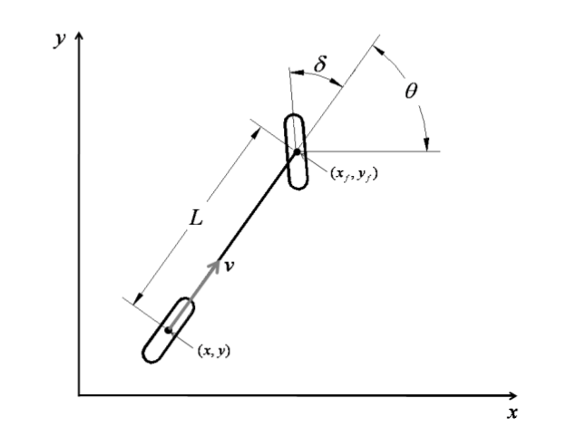
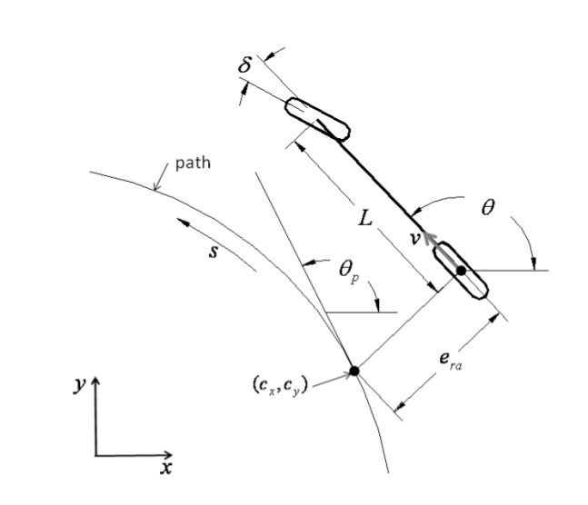

# 车辆运动学模型

### 自行车模型

自行车模型简化了车辆的运动学模型，通常适用于低速场景下的车辆控制。自行车模型只考虑前后两轮，并且不考虑车辆的测滑，车辆的转向由前轮控制，后轮驱动速度。下面简要讨论自行车模型：

上图是自行车运动学的示意图，其中$(x_f, y_f)和(x, y)$分别是车辆的前轮坐标和后轮坐标，$L$是轴距，$\theta$是车辆的航向角，$\delta$是车辆的前轮抓角。

**在自动驾驶控制中，通常会研究车辆的运动学方程，也即如何由当前状态推演到下一个状态，而这个过程也可以考虑为函数的泰勒展开。**

假设在$\Delta t$时间内，车辆在$x$方向的变化量为$\dot{x}$，在$y$方向的变化量为$\dot{y}$，

根据刚体的运动约束，我们可以得到如下几条公式：
$$
\dot{x_f} \sin(\theta + \delta) =  \dot{y_f}cos(\theta + \delta)
$$

$$
\dot{x} \sin(\theta) = \dot{y} \cos(\theta)
$$

根据$x_f, y_f$和$x,y$之间的关系，
$$
x_f = x + L\cos(\theta) \\
y_f = y + L \sin(\theta)
$$
消除$x_f, y_f$有，
$$
\begin {align*}
0 &= \dot{x_f} \sin(\theta + \delta)  - \dot{y_f} \cos(\theta + \delta) \\
 &= \frac{\nabla(x+L\cos(\theta))} {\nabla t} \sin(\theta + \delta) - \frac{\nabla (y+L\sin(\theta))}{\nabla t} \cos(\theta + \delta) \\
&= (\dot{x} - \dot{\theta} L \sin(\theta)) \sin(\theta + \delta) - (\dot{y} + \dot{\theta} \cos(\theta)) \cos(\theta + \delta) \\
&= \dot{x} \sin(\theta + \delta) - \dot{y} \cos(\theta+\delta) \\
 &- \dot{\theta} L \sin(\theta) (\sin(\theta)\cos(\delta) + \sin(\delta)\cos(\theta)) \\
 &- \dot{\theta} L \cos(\theta)(\cos(\theta)\cos(\delta) - \sin(\delta)\sin(\theta)) \\
 &= \dot{x} \sin(\theta + \delta) - \dot{y} \cos(\theta+\delta) - \dot{\theta}L \cos(\delta)
 
\end {align*} \tag{4}
$$
也即是:
$$
\dot{x}\sin(\theta + \delta) - \dot{y}\cos(\theta + \delta) - \dot{\theta} L \cos(\delta) = 0
$$
对于后轮有：
$$
\dot{x} = v \cos(\theta) \\
\dot{y} = v \sin(\theta)
$$
带入(4)有
$$
\dot{\theta} = \frac {v \tan(\delta)}{L}
$$
根据(6)，以及曲率的公式，有
$$
\begin{align*}
R = \frac {v} {\dot \theta} \\
\frac {v \tan(\delta)} {L} = \frac{v}{R} \\
\tan{\delta} = \frac {L} {R}
\end{align*} \tag 7
$$
(7)式用于pure-pursuit中。

我们将(5), (6)用增量方程表示：
$$
\begin{bmatrix} \dot x \\ \dot y \\ \dot \theta \\ \dot \delta \end{bmatrix} = 
\begin{bmatrix} \cos(\theta) \\ \sin(\theta) \\ \frac{\tan(\delta)}{L} \\ 0 \end{bmatrix} v + 
\begin{bmatrix} 0 \\  0 \\ 0 \\ 1\end{bmatrix} \dot{\delta} \tag 8
$$
或者，
$$
\begin{bmatrix} \dot x \\ \dot y \\ \dot \theta \\ \dot \delta \\ \dot v \end{bmatrix} 
=  \begin{bmatrix} 
0 \quad 0 \quad 0 \quad 0 \quad \cos(\theta) \\
0 \quad 0 \quad 0 \quad 0 \quad \sin(\theta) \\
0 \quad 0 \quad 0 \quad 0 \quad \frac {\tan(\delta)} {L} \\
0 \quad 0 \quad 0 \quad 0 \quad 0 \\
0 \quad 0 \quad 0 \quad 0 \quad 0
\end{bmatrix} 
\begin{bmatrix}
x \\ y  \\ \theta \\ \delta \\v
\end{bmatrix} +
\begin{bmatrix}
0 \quad 0 \\
0 \quad 0 \\
0 \quad 0 \\
1 \quad 0 \\
0 \quad 1 \\
\end{bmatrix} \begin{bmatrix} \gamma \\ a \end{bmatrix} \tag 9
$$
其中，$\gamma, a$分别表示前轮转角的速率和加速度，或者
$$
\begin{bmatrix} 
\dot x \\ \dot y \\ \dot \theta \\ \dot v
\end{bmatrix} = 
\begin{bmatrix}
0 \quad 0 \quad 0 \quad \cos(\theta) \\
0 \quad 0 \quad 0 \quad \sin(\theta) \\
0 \quad 0 \quad 0 \quad 0 \\
0 \quad 0 \quad 0 \quad 0 \\
\end{bmatrix}
\begin{bmatrix}
x \\ y \\ \theta \\ v
\end{bmatrix} +
\begin{bmatrix}
0 \quad 0 \\
0 \quad 0 \\
1 \quad 0 \\
0 \quad 1 \\
\end{bmatrix}
 \begin{bmatrix} \gamma \\ a \end{bmatrix} \tag {10}
$$
根据增量方程，可以比较容易的推出下一个时刻的状态，假设车辆状态可以用$\mathbb x(t)$表示，则，
$$
\mathbb x(t+1) = \mathbb x(t) + \dot {\mathbb  x}(t) * \Delta t \tag{11}
$$
基于式(11)，我们可以得到各类方程，一种常用的方程：
$$
\begin{bmatrix} 
x(t+1) \\ y(t+1) \\ \theta(t+1) \\ v(t+1)
\end{bmatrix} =
\begin{bmatrix}
1 \quad 0 \quad 0 \quad \cos(\theta(t)) dt \\
0 \quad 1 \quad 0 \quad \sin(\theta(t)) dt \\
0 \quad 0 \quad 1 \quad 0 \\
0 \quad 0 \quad 0 \quad 1
\end{bmatrix}
\begin{bmatrix}
x(t) \\ y(t) \\ \theta(t) \\ v(t)
\end{bmatrix} +
\begin{bmatrix}
0 \quad 0 \\
0 \quad 0 \\
1 \quad 0 \\
0 \quad 1
\end{bmatrix} \begin{bmatrix} \delta(t) \\ a(t)\end{bmatrix} \tag{12}
$$
当然根据状态表示的不同，可以得到不同的状态方程。

### Path Coordinate

大部分时候，我们可以直接在全局坐标系下，做控制，但是有些情况下，需要在路径坐标下做控制。

如图所示，$\theta$是车辆的航向角，$\theta_p$是车辆最近点P$(c_x, c_y)$的切线角度，$e_{ra}$是横向距离误差。对于轨迹，可以将$\theta_p$表示关于距离s的函数。

定义方向误差$\theta_e$，且有
$$
\theta_e =  \theta_p(s) - \theta \tag{13}
$$
根据曲率计算公式，有：
$$
k_p = \frac {d \theta_p(s)} {ds} \tag{14}
$$
也即是
$$
\dot \theta_p(s) = k_p \dot s \tag{15}
$$
我们先看$e_{ra}$的增量，:
$$
\dot e_{ra} = v \sin(\theta_e) \tag{16}
$$
接下来，我们计算$\dot s$，s的计算需要回到x-y坐标系下。我们知道在$\Delta t$时间内，车辆水平方向移动的距离为$v \cos(\theta)$，所以根据p点的切线方向有：
$$
\begin{align*}
\dot s &=  v\ cos(\theta) \sqrt{1 + \tan^2(\theta_p(s))} \\
 &= \frac {v \cos(\theta) } { \cos(\theta_p(s) ) }  \\
 &= \frac {v \cos(\theta_p(s) + \theta_e)} { \cos(\theta_p(s)) } \\
 &= \frac {v \cos (\theta_p(s))\ cos(\theta_e) + v\sin(\theta_p(s)) \sin(\theta_e))} {cos(\theta_p(s))} \\
 &=  v\cos(\theta_e) + v \sin(\theta_e) \tan( \theta_p(s))  \\
 &= v\cos(\theta_e) + \dot \theta_p(s)  \dot(e_{ra})
\end{align*} \tag {17}
$$
也即是
$$
\dot s = v \cos(\theta_e) + \dot e_{ra} \dot \theta_p(s) \tag {18}
$$
1根据式(15)和式(17)，可得
$$
\dot s = \frac {v cos(\theta_e)} {1 - \dot e_{ra} k(s)} \tag{19}
$$
所以如果将状态表示为$(s, e_{ra}, \theta_e)$，我们可得增量方程为：
$$
\begin{bmatrix}
\dot s \\ \dot e_{ra} \\ \dot \theta_e \\ \dot \delta
\end{bmatrix} = 
\begin{bmatrix}
\frac {\cos(\theta_e)} {1 - \dot e_{ra} k(s)} \\
\sin(\theta_e) \\
\frac {tan(\delta)} {L} - \frac{k(s)\cos(\theta_e)}{1 - \dot e_{ra} k(s)} \\
0
\end {bmatrix}  v + 
\begin{bmatrix} 0 \\ 0 \\0  \\ 1 \end{bmatrix} \dot {\delta} \tag{20}
$$
有了状态方程之后，我们就可以考虑使用MPC或者LQR计算车辆控制了。

### reference

1. Automatic Steering Methods for Autonomous Automobile Path Tracking
2. Improved Trajectory Planning for On-Road Self-Driving Vehicles Via Combined Graph Search, Optimization & Topology Analysis