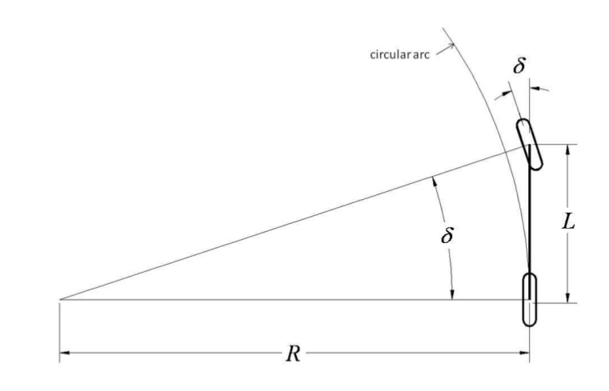
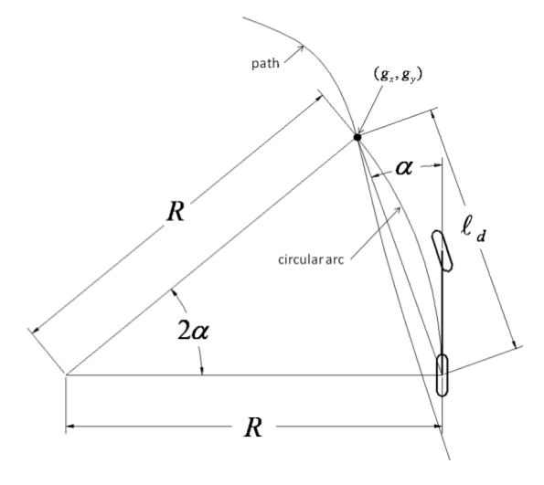
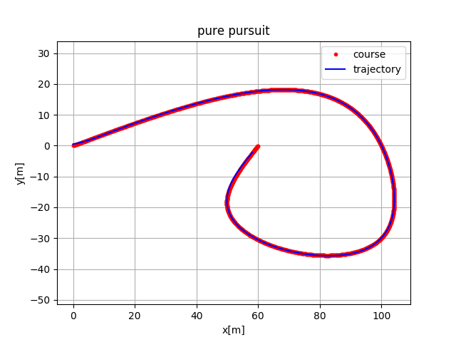
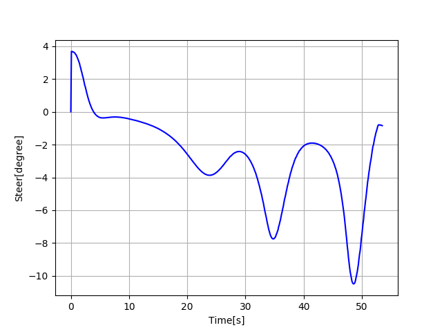

# Pure Pursuit 算法

### 车辆转弯的几何原理

车辆转弯处一般是按照阿克曼动力学模型计算，依据刚体运动模型，转弯时，刚体只能有一个转动中心，所以两侧轮胎转动的角度是不一样的。不过这里将四轮模型简化为二轮自行车模型考虑。

**自行车模型多在低速场景下使用**



如上图所示，R是转动半径，L是车辆轴距，$\delta$是前轮转角。根据简单的三角关系有：
$$
tan(\delta) = \frac {L} {R}
$$

### Pure pursuit方法

Pure Pursuit方法如其名，就是一个最直接的预瞄法，与我们日常驾驶相似，找到一个预瞄点，然后依据这个点逐步调整角度。



上图是Pure pursuit算法的几何示意图，其中$p(g_x, g_y)$是预瞄点，$\ell_d$是车辆最近点到预瞄点的距离，R是转弯半径。根据三角几何学有：
$$
\frac {\ell_d} {\sin(2\alpha)} = \frac {R} {\sin(\frac{\pi} {2} - \alpha)}
$$
也即：
$$
R = \frac {\ell_d} { 2 \sin(\alpha)}
$$
也可以写成：
$$
k = \frac {2 \sin(\alpha)} {\ell_d}
$$
其中$k$是弧线的曲率。

所以基于(1)式有，
$$
\delta = \arctan(k L) \\
 \delta = \arctan( \frac {2L\sin(\alpha)} {\ell_d})
$$
定义$e_{\ell_d}$是横向误差，且$\sin(\alpha) = \frac{e_{\ell_d}} {\ell_d}$，所以有
$$
k = \frac{2}{\ell_d^2} e_{\ell_d}
$$
通常$\ell_d$是与速度相关的，是几个特定的常量，所以可以认为转向角度实际是只跟横向误差有关，这里主要用于实际分析。


### 方法实现

**基本流程**

1. 获取当前车辆位置在轨迹中的最近点
2. 根据最近点及预瞄距离，计算参考轨迹上的预瞄点
3. 根据预瞄点及当前位置计算前轮转角

```python
def latitude_control(state, target, L):
    """
    pure-pursuit here.
    :param state: [x, y, yaw, v]
    :param target: [x, y, yaw, v]
    :return:
    """
    dx = target[0] - state[0]
    dy = target[1] - state[1]
    alpha = normalize_angle(math.atan2(dy, dx) - state[2])
    dist = math.sqrt(dx ** 2 + dy ** 2)
    return math.atan2(2 * L * math.sin(alpha) / dist, 1.0)


def distance(p1, p2):
    return math.sqrt((p1[0] - p2[0]) ** 2 + (p1[1] - p2[1]) ** 2)


def find_closest(state, lastIdx, waypoints):
    """
    :param state: [x, y, yaw, v]
    :param lastIdx:
    :param waypoints:
    :return:
    """
    dist = [distance(state, waypoints[i]) for i in range(lastIdx, len(waypoints))]
    closest = dist.index(min(dist)) + lastIdx
    return closest


def find_target(closest, waypoints, look_forward):
    """
    :param closest: int
    :param waypoints: [[x, y, yaw, v], [x, y, yaw, v], ...]
    :param look_forward: \ell_d
    :return:
    """
    look_ahead_distance = 0
    target = closest
    while look_ahead_distance < look_forward and target + 1 < len(waypoints):
        look_ahead_distance += distance(waypoints[target], waypoints[target + 1])
        target += 1
    if target >= len(waypoints):
        target = len(waypoints) - 1
    return target, look_ahead_distance
```

完整代码参考: [pure_pursuit.py](../../src/PathTracking/pure_pursuit.py)

仿真效果展示





### Cutting Corners问题

Pure Pursuit算法在实际应用中，会在小转弯下，明显的向规划的路线内部切入，这是由于预瞄的时候，并不会考虑是否贴合路径，而只考虑预瞄点和当前航向的方向差。


### ref

1. Automatic Steering Methods for Autonomous Automobile Path Tracking
2. Improved Trajectory Planning for On-Road Self-Driving Vehicles Via Combined Graph Search, Optimization & Topology Analysis