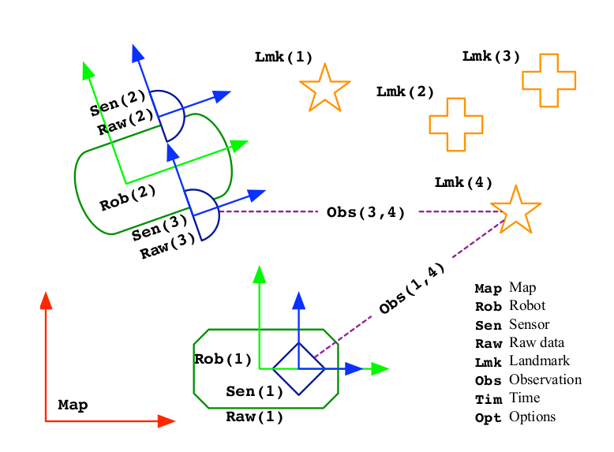
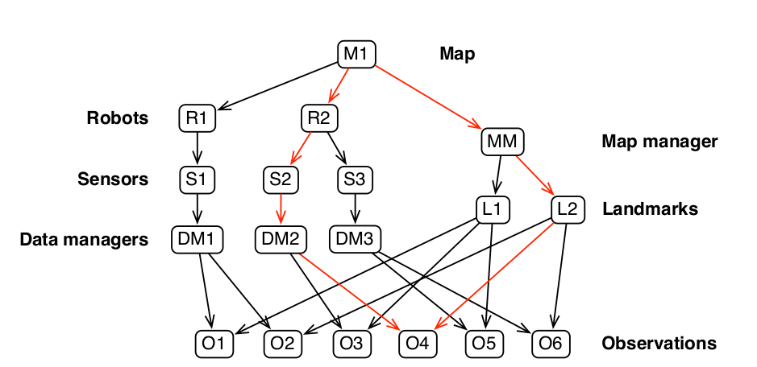
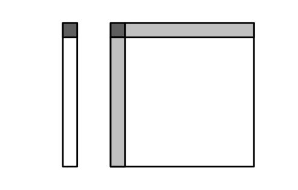
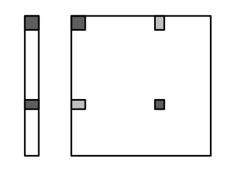
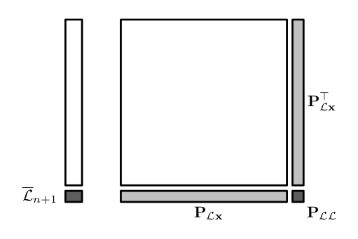

# EKF-SLAM

**注：这里是在SLAM_Course 材料的基础上对ekf-slam及其实现过程进行阐述，建议对比原文来看**

### Simultaneous Localization and Mapping (SLAM)问题介绍

SLAM中文翻译同时建图与定位，是一种广泛存在于生活中的问题：当我们探索一个未知空间的时候，就是一个建图与定位的过程，一边在空间中行走，一边观察空间中的标记物，并在脑海中逐渐构建一副地图，根据这幅地图，我们可以判定如何从这个空间中离开，判定当前所在的未知。SLAM技术目前主要应用于移动机器人技术，包括仓储机器人以及自动驾驶。

SLAM通常包含3种不断重复的操作：

1. 移动：机器人移动到一个新位置，通常可以根据移动指令及运动模型推断得到新的位置，但是由于移动过程包含了不可消除的噪声，所以计算得到的位置并不准确，**这里比较关心车辆的运动模型Motion model**
2. 观测环境中的地标点：当移动到一个新位置后，机器人可以感知得到环境中新的地标点，这些地标点会被加入到地图中。我们需要根据机器人位姿和感知数据，确定地标点在地图上的位置。由于传感器感知也包含了各类噪声，所以同样无法准确计算地标点的位置。**这里比较关心逆向观测模型（Inverse observation model）**
3. 将观测到的地标点和地图上已有的地标点关联起来。在移动过程中，机器人可能会在多个位置观测到同一个地标，如果计算准确以及不存在噪声，那么机器人在不同位置观测相同的地标得到的位置应该是相同的，但是实际过程中，噪声以及计算误差会使得计算的位置有比较大的偏差。这时可以通过将数据关联起来，消除运动过程和观测过程的累计误差。**这里比较关心观测模型（Direct observation model）**

针对这3个操作，这里只探索平面上的机器人移动，对于三维空间上的移动这里暂不考虑。

SLAM中的各种关系：

#### 三类模型介绍

1. Motion-model

   通常机器人的移动是根据发出的指令信号$\mathbb u$和扰动量决定：
   $$
   \mathcal R \leftarrow \mathbb f(\mathcal R, \mathbb u, \mathcal c)
   $$
   通常机器人的状态可以用$\mathcal R_2 = (x, y, \theta)$表示，三维是用$\mathcal R_3=(x, y, z, roll, pitch, yaw)$表示。例如在低速情况下，可以用自行车模型作为运动模型。模型具体根据机器人的移动方式来选择。

2. Observation-model

   机器人通过某个传感器S观测到某个地标点$\mathcal L_i$,则有测量值$\mathbb y_i$：
   $$
   \mathbb y_i = h(\mathcal R, S, \mathcal L_i)
   $$

3. Inverse-observation-model

   通过测量值和车辆的状态，我们可以得到地标$\mathcal L_i$:
   $$
   \mathcal L_i = g(\mathcal R, S, \mathbb y_i)
   $$
   理想情况下，g是h的逆，但是很多时候h是不可逆的，例如单目视觉里。

### EKF-SLAM

​	*这里假设已经了解EKF—SLAM算法了，如果不清楚，可以参看[EKF](./Nonlinear-kalman.md)*

这里先给出EKF和SLAM以及机器人的动作对应关系表。

| Event                  | SLAM            | EKF            |
| ---------------------- | --------------- | -------------- |
| Move                   | Robot Motion    | ekf prediction |
| 观测到新的Landmark     | Landmark 初始化 | 添加状态       |
| 观测到已有Landmark     | 地图修正        | EKF-correction |
| 地图上已有landmark损毁 | Landmark 删除   | 状态删除       |

接下来，我们分别讨论每一类事件，并讨论如何维护地图。

#### map

map中主要保存的是已有的地标点，而在ekf-slam中，通常将机器人的状态和地标的状态一起保存维护：
$$
\mathbb x = \begin{bmatrix} \mathcal R \\ \mathcal M \end{bmatrix} = \begin{bmatrix} \mathcal R \\ \mathcal L_1 \\
\vdots \\ \mathcal L_n \end{bmatrix}
$$
在ekf中，需要用均值$\mathbb{\bar x} $和方差$P$表示状态$\mathbb x$,
$$
\mathbb {\bar x} = \begin{bmatrix} \mathcal {\bar R} \\ \mathcal {\bar M} \end{bmatrix} = \begin{bmatrix} \mathcal {\bar R} \\ \mathcal {\bar L_1} \\
\vdots \\ \mathcal {\bar L_n} \end{bmatrix}
$$

$$
P = \begin{bmatrix} P_{\mathcal R \mathcal R} \quad P_{\mathcal R \mathcal M} \\ P_{\mathcal M \mathcal R} \quad P_{\mathcal M \mathcal M} \end{bmatrix} = 
\begin{bmatrix}
P_{\mathcal R \mathcal R} \quad P_{\mathcal R \mathcal L_1} \quad \cdots \quad P_{\mathcal R \mathcal L_n} \\
P_{\mathcal L_1 \mathcal R} \quad P_{\mathcal L_1 \mathcal L_1} \quad \cdots \quad P_{\mathcal L1 \mathcal L_n} \\
\vdots \quad \quad \vdots \quad \quad \ddots \quad \vdots  \\
P_{\mathcal L_n \mathcal R} \quad P_{\mathcal L_n \mathcal L_1} \quad \cdots \quad P_{\mathcal L_n \mathcal L_n}
\end{bmatrix}
$$

所以关键就是如何维护均值跟方差。

**地图初始化**

初始时，地图上没有地标点，并且所有状态都是确定的，不存在不确定状态，$\mathbb {\bar x}和方差P$分别是：
$$
\mathbb {\bar x} = \begin{bmatrix} 0 \\ 0 \\ 0\end{bmatrix}
$$

$$
P = \begin{bmatrix} 0 \quad 0 \quad 0 \\ 0 \quad 0 \quad 0 \\ 0 \quad 0 \quad 0 \end{bmatrix}
$$

**Robot Motion**

机器人的运动只会影响机器人的状态，对地标的状态没有影响，通常来说根据车辆移动模型我们知道：
$$
\mathbb x = \mathbb f(\mathbb x, \mathbb u, \mathbb n)
$$
所以EKF的预测步骤有：
$$
\mathbb {\bar x} = \mathbb f(\mathbb {\bar x}, \mathbb u, 0) \\
P = F_{\mathbb x} P F_{\mathbb x}^T + F_{\mathbb n}NF_{\mathbb n}^T \\
$$
其中，
$$
F_{\mathbb x} = \frac {\partial \mathbb f(\mathbb {\bar x}, \mathbb u)} {\partial \mathbb x} \\
F_{\mathbb n} = \frac {\partial \mathbb f(\mathbb {\bar x}, \mathbb u)} {\partial \mathbb n} 
$$
$F_{\mathbb n} N F_{\mathbb n}^T$实际中，也可以直接写成过程噪声矩阵$Q$。

由于机器人的移动只影响了机器人的状态，也就是：
$$
\mathcal R \leftarrow f_{\mathcal R} (\mathcal R, \mathbb u, \mathbb n) \\
\mathcal M \leftarrow \mathcal M
$$
所以可以确定雅克比矩阵$F_{\mathbb x}$一定是稀疏的，可以表示为：
$$
F_{\mathbb x} = \begin {bmatrix}
\frac{\partial f_\mathcal R} {\partial \mathcal R} \quad 0 \\
0 \quad I
\end {bmatrix}
$$

$$
F_{\mathbb n} = \begin {bmatrix} \frac {\partial f_{\mathcal R}} {\partial \mathbb n} \\ 0 \end {bmatrix}
$$

​		Robot motion 时，地图数据更新。左侧是状态，右侧是方差。其中左侧深灰色是机器人状态，右侧深灰色表示的是机器人状态的协方差矩阵，浅灰色分别表示$\mathcal R \mathcal M$ 和$\mathcal M \mathcal R$的协方差矩阵。

为了减少无用计算，实际的预测过程则按照以下的几条公式求解：
$$
\mathcal {\bar R} \leftarrow f_{\mathcal R} (\mathcal {\bar R}, \mathbb u, 0)
$$

$$
P_{\mathcal R \mathcal R} \leftarrow \frac {\partial f_\mathcal R} {\partial \mathcal R} P_{\mathcal R \mathcal R} \frac {\partial f_\mathcal R} {\partial \mathcal R}^T + Q
$$

$$
P_{\mathcal R \mathcal M} \leftarrow \frac {\partial f_\mathcal R} {\partial \mathcal R} P_{\mathcal R \mathcal M}
$$

$$
P_{\mathcal M \mathcal R} \leftarrow P^T_{\mathcal R \mathcal M}
$$

**观测到已有地标**

先讨论当观测到已有地标时如何更新地图状态。假设测量函数为：
$$
\mathbb y = h(\mathbb x) + \mathbb v
$$
其中，$\mathbb  y$是测量值，$\mathbb x$是当前的状态，$\mathbb v$是观测噪声，$h$是观测函数，EKF过程基本可以写成如下形式：
$$
\mathbb {\bar z} = \mathbb y - h(\mathbb {\bar x})
$$

$$
Z = H_{\mathbb x} P H_{\mathbb x}^T + R
$$

$$
K = P H_{\mathbb x}^T Z^{-1}
$$

$$
\mathbb {\bar x} = \mathbb {\bar x}  + K \mathbb {\bar z}
$$

$$
P = P - K Z K^T
$$

其中，$H_{\mathbb x} = \frac {\partial h(\mathbb {\bar x})} {\partial \mathbb x}$。

在Ekf-slam中，地标的状态，只跟Robot状态，传感器以及地标有关，所以观测模型可以写成如下形式：
$$
\mathbb y_i = h_i(\mathcal R, \mathcal S, \mathcal L_i) + \mathbb v
$$
所以$H_{\mathbb x}$是一个稀疏的矩阵，其形式如下：
$$
H_{\mathbb x} = \begin{bmatrix}H_{\mathcal R} \quad 0 \quad \cdots \quad 0 \quad H_{\mathcal L_i} \quad 0 \quad \cdots \quad 0 \end{bmatrix}
$$
其中，
$$
H_{\mathcal R} = \frac {\partial h_i(\mathcal R, \mathcal S, \mathcal L_i)} {\partial \mathcal R}
$$

$$
H_{\mathcal L_i} = \frac {\partial h_i({\mathcal R, \mathcal S, \mathcal L_i})} {\partial \mathcal L_i}
$$

​				观测到已有目标时更新地图的状态，左侧是地图状态，右侧是协方差矩阵。

完整的更新公式如下：
$$
\mathbb {\bar z} = \mathbb y_i - h_i(\mathcal {\bar R}, \mathcal S, \mathcal {\bar L_i})
$$

$$
Z = \begin{bmatrix} H_\mathcal R  \quad H_\mathcal {L_i} \end{bmatrix} 
\begin{bmatrix}
P_{\mathcal R \mathcal R} \quad P_{\mathcal R \mathcal L_i} \\
P_{\mathcal L_i \mathcal R} \quad P_{\mathcal L_i \mathcal L_i}
\end{bmatrix}
\begin{bmatrix}
H^T_\mathcal R \\ H^T_\mathcal {L_i}
\end{bmatrix} + R
$$

$$
K =
\begin{bmatrix}
P_{\mathcal R \mathcal R} \quad P_{\mathcal R \mathcal L_i} \\
P_{\mathcal L_i \mathcal R} \quad P_{\mathcal L_i \mathcal L_i}
\end{bmatrix} \begin{bmatrix}
H^T_\mathcal R \\ H^T_\mathcal {L_i}
\end{bmatrix} Z^{-1}
$$

$$
\mathbb {\bar x} \leftarrow \mathbb {\bar x} + K \mathbb {\bar z}
$$

$$
P \leftarrow P - KZK^T
$$

**地标初始化** 

当观测到新地标时，需要将地标初始化并加入到地图中维护状态。这里需要根据观测模型是不是可逆分解成两种情况。

​						新添加地标时，状态向量和协方差矩阵要更新的部分。

如果观测模型可逆，也就是$h$存在反函数$g$，这时地标位置：
$$
\mathcal L_{n + 1} = g(\mathcal R, \mathcal S, \mathbb u_)
$$
下面分别计算$\mathcal {\bar L_{n+1}}和P_{\mathcal R \mathcal L_{n+1}}$,
$$
\mathcal {\bar L_{n+1}} = g(\mathcal {\bar R}, \mathcal S, \mathbb y_{n+1})
$$

$$
G_{\mathcal R} = \frac {\partial g(\mathcal {\bar R}, \mathcal S, \mathbb y_{n+1})} {\partial \mathcal R}
$$

$$
G_{\mathbb y_{n+1}} = \frac {\partial g(\mathcal {\bar R}, \mathcal S, \mathbb y_{n + 1})} {\partial \mathbb y_{n+1}}
$$

$$
P_{\mathcal L \mathcal L} = G_\mathcal R P_{\mathcal R \mathcal R} G^T_\mathcal R  + G_{\mathbb y_{\mathbb n + 1}} R G_{\mathbb y_{\mathbb n + 1}}^T
$$

$$
P_{\mathcal L \mathbb x} = G_\mathcal R P_{\mathcal R \mathbb x} =  G_\mathcal R  \begin{bmatrix} P_{\mathcal R \mathcal R} \quad P_{\mathcal R \mathcal M} \end{bmatrix}
$$

所以完整的更新如下：
$$
\mathbb {\bar x} = \begin{bmatrix} \mathbb {\bar x} \\ \mathcal {\bar L_{n+1}} \end{bmatrix}
$$

$$
P = \begin{bmatrix}  P \quad P^T_{\mathcal L \mathbb x} \\
P_{\mathcal L \mathbb x} \quad P_{\mathcal L \mathcal L}
\end{bmatrix}
$$

如果观测模型不可逆，通常是依据某个先验信息求解，比如单目相机会依据摄像机的内外参数求解，一般反向映射函数可以写成如下形式：
$$
\mathcal L_{n+1} = g(\mathcal R, \mathcal S, \mathbb y_{n+1}, \mathbb s)
$$
其中$\mathbb s$是先验信息。假设$\mathbb s$是均值，$S$是其方差，则有

$$
\mathcal {\bar L_{n+1}} = g(\mathcal {\bar R}, \mathcal S, \mathbb y_{n+1}, \mathbb s)
$$

$$
G_{\mathcal R} = \frac {\partial g(\mathcal {\bar R}, \mathcal S, \mathbb y_{n+1}, \mathbb s)} {\partial \mathcal R}
$$

$$
G_{\mathbb y_{n+1}} = \frac {\partial g(\mathcal {\bar R}, \mathcal S, \mathbb y_{n + 1}, \mathbb s)} {\partial \mathbb y_{n+1}}
$$

$$
G_\mathbb s = \frac {\partial g(\mathcal {\bar R}, \mathcal S, \mathbb y_{n + 1}, \mathbb s)} {\partial \mathbb s}
$$

$$
P_{\mathcal L \mathcal L} = G_\mathcal R P_{\mathcal R \mathcal R} G^T_\mathcal R  + G_{\mathbb y_{\mathbb n + 1}} R G_{\mathbb y_{\mathbb n + 1}}^T + G_\mathbb s S G^T_\mathbb s
$$

$$
P_{\mathcal L \mathbb x} = G_\mathcal R P_{\mathcal R \mathbb x} =  G_\mathcal R  \begin{bmatrix} P_{\mathcal R \mathcal R} \quad P_{\mathcal R \mathcal M} \end{bmatrix}
$$

所以完整的更新如下：
$$
\mathbb {\bar x} = \begin{bmatrix} \mathbb {\bar x} \\ \mathcal {\bar L_{n+1}} \end{bmatrix}
$$

$$
P = \begin{bmatrix}  P \quad P^T_{\mathcal L \mathbb x} \\
P_{\mathcal L \mathbb x} \quad P_{\mathcal L \mathcal L}
\end{bmatrix}
$$
