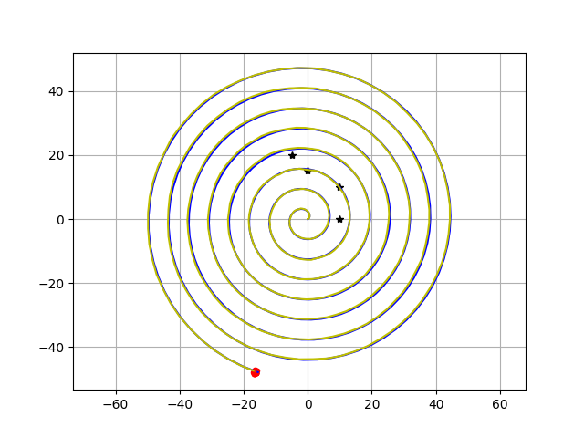
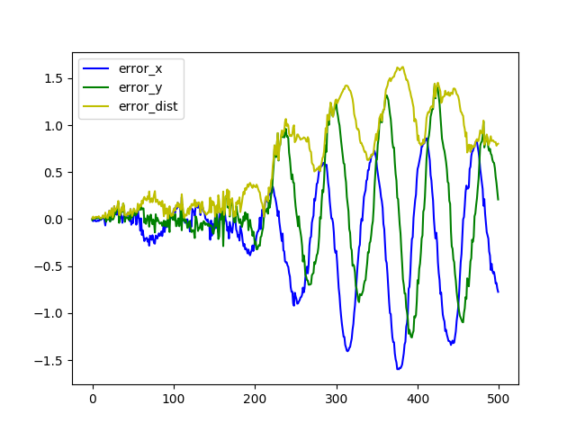

# 粒子滤波


### 基本理论介绍

前面介绍无迹卡尔曼滤波时，介绍了对于非线性的分布比较难处理时，可以直接用蒙特卡罗近似原分布。而这一点在粒子滤波中被大量使用。

对于一个概率密度函数为$p(\mathbb x)$的分布，我们知道其均值和方差分别可以由以下公式计算：
$$
E(f(\mathbb x)) = \int f(\mathbb x) p(\mathbb x) d \mathbb x \\
Var{f(\mathbb x)} = E(f(\mathbb x) - E(f(\mathbb x))^2 = \int (f(\mathbb x) - E(f(\mathbb x))^2p(\mathbb x) d\mathbb x
$$
根据基本统计知识有，对一批数据${\mathbb y_i}$计算其均值和方差的方法为：
$$
\bar {\mathbb y} = \frac{1}{n} \Sigma_{i=1}^n \mathbb y_i
$$

$$
Var(\mathbb y) = \frac{1}{n} \Sigma_{i=1}^n(\mathbb y_i - \bar {\mathbb y})^2
$$

所以，是不是可以根据分布生成一批数据，然后对这批数据做变换，然后统计这批数据的均值和方差，实际就是变换后的分布。这就是粒子滤波的主体思路。

更多具体推导可参考[粒子滤波从推导到应用](https://blog.csdn.net/heyijia0327/article/details/40929097)

粒子滤波算法基本框架

1. t=0时刻，粒子初始化，根据初始的均值和方差生成一批例子。

2. for  t > 0:

   ​	a. 预测。根据系统模型，对输入数据加上过程噪声，预测粒子的下一状态，统计更新后的粒子均值和方差得到预测结果。

   ​	b. 更新。根据观测值更新噪声。测量观测值和粒子的观测值的残差，计算残差关于采样噪声的概率值，作为权重。

   ​	c. 重采样。对粒子群重新采样，剔除一些权重值特别小的粒子，对权重值比较高的点多采样。

   ​	d. 估计值。根据粒子的状态和权重值，重新计算均值和方差。

### 重采样方法介绍

重采样方法有很多种，这里只介绍一种，重要性重采样。

重要性重采样的基本思路就是更相信权重比较大的粒子，所以采样时主要选取权重比较大的粒子。

重要性重采样的算法如下：

```
resample(n, particles, weights):

Neff = 0
for i from 1 to n:
	sum_weight = weights[i] * weights[i]
if 1. / Neff < N_TH:
	wcum = [0] * n
	new_particles = {}
	new_weights = [0] * n
	for i from 1 to n:
		wcum[i] = wcum[i-1] + weight[i]
	for i from 1 to n:
		p = random.uniform(0, 1)
		find j, wcum[j] < p <= wcum[j+1]
		copy particle j to new_particles
		new_weights[i] = weights[j]
		
	particles = new_particles
	weights = new_weights
	normalize(weights)
return particles, weights
```


### 应用举例

这次使用粒子滤波实现前面的车辆状态跟踪。

完整源码参考[particle_filter](../src/filter/particle_filter.py)

```python
class ParticleFilter(object):
    def __init__(self, initial_X, initial_std, number_particles):
        self.np = number_particles
        self.particles = self._initial_prarticles(initial_X, initial_std, number_particles)
        self.weights = np.matrix(np.zeros((number_particles, 1))) + 1.0 / number_particles
        self.NTH = number_particles * 1 / 4
        print(type(self.weights))

    def _initial_prarticles(self, initial_X, initial_std, number_particles):
        particles = np.matrix(np.zeros((initial_X.shape[0], number_particles)))
        particles[0, :] = initial_X[0,0] + (np.random.randn(number_particles)) * initial_std[0, 0]
        particles[1, :] = initial_X[1,0] + (np.random.randn(number_particles)) * initial_std[1, 0]
        particles[2, :] = initial_X[2, 0] + (np.random.randn(number_particles)) * initial_std[2, 0]
        particles[2, :] %= (2 * np.pi)
        particles[3, :] = initial_X[3, 0] + (np.random.randn(number_particles)) * initial_std[3, 0]
        return particles

    def _move_motion(self, X, u, dt):
        F = np.matrix([[1., 0., 0., dt * math.cos(X[2])],
                       [0., 1., 0., dt * math.sin(X[2])],
                       [0., 0., 1., 0.],
                       [0., 0., 0., 1.]])
        B = np.matrix([[0, 0.],
                       [0, 0.],
                       [0., dt],
                       [dt, 0.]])
        X_pred = F * X + B * u
        return X_pred

    def calc_convariance(self, X_mean):
        covariance = np.zeros((4, 4))
        for i in range(self.np):
            dx = self.particles[:, i:i+1] - X_mean
            covariance += self.weights[i, 0] * dx * dx.T
        return covariance

    def predict(self, u, Q, dt=0.1):
        for i in range(self.np):
            u_p = np.zeros((2, 1))
            u_p[0, 0] = u[0,0] + np.random.randn() * Q[0, 0]
            u_p[1, 0] = u[1,0] + np.random.randn() * Q[1, 1]
            self.particles[:, i:i+1] = self._move_motion(self.particles[:, i:i+1], u_p, dt)
        X = self.particles * self.weights
        P = self.calc_convariance(X)
        return X, P

    def gauss_likelihood(self, x, sigma):
        p = 1.0 / math.sqrt(2.0 * math.pi * sigma ** 2) * math.exp(-x **2/(2 * sigma ** 2))
        return p

    def update(self, Z_observed, R):
        for i in range(self.np):
            X = self.particles[:, i]
            # w = self.weights[i, 0]
            w = 1.0
            for z_j, lx_j, ly_j in Z_observed:
                dx = lx_j - X[0]
                dy = ly_j - X[1]
                z_pre = math.sqrt(dx * dx + dy * dy)
                dz = z_j - z_pre
                w = w * self.gauss_likelihood(dz, math.sqrt(R[0, 0]))
            self.weights[i, 0] = w

        self.weights += 1.e-300
        self.weights = self.weights / self.weights.sum()
        # try to resample
        self.resample()
        X = self.particles * self.weights
        P = self.calc_convariance(X)
        return X, P

    def random(self):
        resampleid = np.zeros((1, self.np))
        for i in range(self.np):
            resampleid[0, i] = random.uniform(0, 1.0)
        # base = np.cumsum(self.weights * 0.0 + 1 / self.np) - 1 / self.np
        # resampleid = base + np.random.randn(base.shape[1]) / self.np
        return resampleid

    def resample(self):
        self.weights += 1.e-300
        Neff = 1.0 / (self.weights.T * self.weights)[0, 0]
        if Neff < self.NTH:
            wcum = np.cumsum(self.weights, axis=0)
            wcum[-1, 0] = 1.
            indexes = []
            resampleid = self.random()
            for i in range(self.np):
                ind = 0
                while wcum[ind, 0] < resampleid[0, i]:
                    ind += 1
                indexes.append(ind)

            self.particles[:, :] = self.particles[:, indexes]
            self.weights[:, 0] = self.weights[indexes, 0]
            self.weights /= np.sum(self.weights)

    def get_particles(self):
        return self.particles

```



